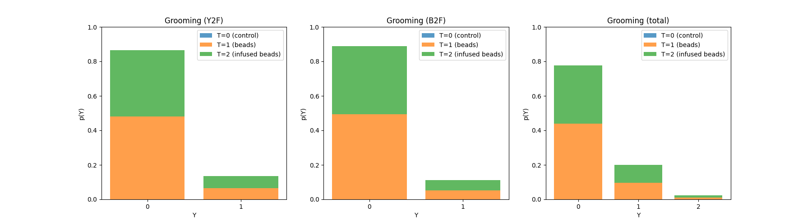

# [anonymized]Ant

Automatic treatment effect estimation on ecological data with partial labelling.

## Dataset 
Preliminary release at [google drive](https://drive.google.com/drive/folders/1ZTPusp-u3pAtrs2LtA3JUaFXbuqDS7K_?usp=sharing)

### Example

<table align="center">
  <tr>
    <th>No Action</th>
    <th>Grooming (<i>Y2F</i>)</th>
  </tr>
  <tr>
    <td></td> 
    <td></td>
  </tr>
</table>

### Data Distribution

### Research Question

Identify and estimate:
$$ATE := \mathbb{E}[Y|do(T=2)]- \mathbb{E}[Y|do(T=1)]$$
